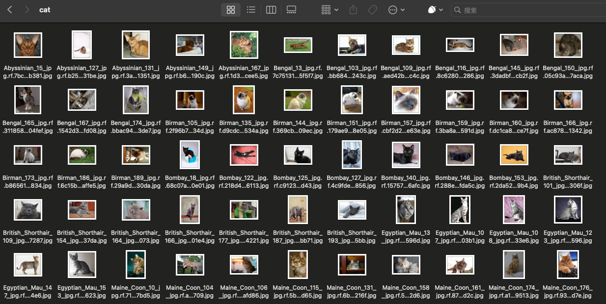
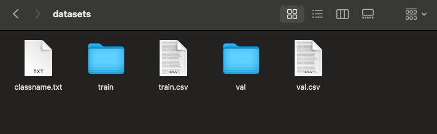

# Resnet50-cats_vs_dogs

[](https://zhuanlan.zhihu.com/p/676430630)

猫狗分类是计算机视觉最基础的任务之一——如果说完成MNIST手写体识别是实现CV的“Hello World”，那猫狗分类就是旅程的下一站～。

这篇文章我将带大家使用PyTorch、SwanLab、Gradio三个开源工具，完成从**数据集准备、代码编写、可视化训练到构建Demo网页**的全过程。

> 代码：[Github](https://github.com/xiaolin199912/Resnet50-cats_vs_dogs)
> 
> 在线Demo: [SwanHub](https://swanhub.co/ZeYiLin/Resnet50-cats_vs_dogs/demo)
> 
> 数据集：[百度云](https://pan.baidu.com/s/1qYa13SxFM0AirzDyFMy0mQ) 提取码: 1ybm
> 
> 三个开源库：[pytorch](https://github.com/pytorch/pytorch)、[SwanLab](https://github.com/SwanHubX/SwanLab)、[Gradio](https://github.com/gradio-app/gradio)


# 1. 准备部分

## 1.1 安装Python库

需要安装下面这4个库：

```bash
torch>=1.12.0
torchvision>=0.13.0
swanlab>=0.3.3
gradio
```

安装命令：

```bash
pip install torch>=1.12.0 torchvision>=0.13.0 swanlab>=0.3.3 gradio
```

## 1.2 创建文件目录

现在打开1个文件夹，新建下面这5个文件： 

它们各自的作用分别是：

*   `checkpoint`：这个文件夹用于存储训练过程中生成的模型权重。
*   `datasets`：这个文件夹用于放置数据集。
*   `app.py`：运行Gradio Demo的Python脚本。
*   `load_datasets.py`：负责载入数据集，包含了数据的预处理、加载等步骤，确保数据以适当的格式提供给模型使用。
*   `train.py`：模型训练的核心脚本。它包含了模型的载入、训练循环、损失函数的选择、优化器的配置等关键组成部分，用于指导如何使用数据来训练模型。

## 1.3 下载猫狗分类数据集

数据集来源是Modelscope上的[猫狗分类数据集](https://modelscope.cn/datasets/tany0699/cats_and_dogs/summary)，包含275张图像的数据集和70张图像的测试集，一共不到10MB。
我对数据做了一些整理，所以更推荐使用下面的百度网盘链接下载：

> 百度网盘：链接: <https://pan.baidu.com/s/1qYa13SxFM0AirzDyFMy0mQ> 提取码: 1ybm


将数据集放入`datasets`文件夹：


ok，现在我们开始训练部分！

> ps：如果你想要用更大规模的数据来训练猫狗分类模型，请前往文末的相关链接。

# 2. 训练部分

ps：如果想直接看完整代码和效果，可直接跳转到第2.9。

## 2.1 load_datasets.py

我们首先需要创建1个类`DatasetLoader`，它的作用是完成数据集的读取和预处理，我们将它写在`load_datasets.py`中。
在写这个类之前，先分析一下数据集。
在datasets目录下，`train.csv`和`val.csv`分别记录了训练集和测试集的图像相对路径（第一列是图像的相对路径，第二列是标签，0代表猫，1代表狗）：


左图作为train.csv，右图为train文件夹中的cat文件夹中的图像。

那么我们的目标就很明确：

1.  解析这两个csv文件，获取图像相对路径和标签
2.  根据相对路径读取图像
3.  对图像做预处理
4.  返回预处理后的图像和对应标签

明确了目标后，现在我们开始写`DatasetLoader`类：

```python
import csv
import os
from torchvision import transforms
from PIL import Image
from torch.utils.data import Dataset

class DatasetLoader(Dataset):
    def __init__(self, csv_path):
        self.csv_file = csv_path
        with open(self.csv_file, 'r') as file:
            self.data = list(csv.reader(file))

        self.current_dir = os.path.dirname(os.path.abspath(__file__))

    def preprocess_image(self, image_path):
        full_path = os.path.join(self.current_dir, 'datasets', image_path)
        image = Image.open(full_path)
        image_transform = transforms.Compose([
            transforms.Resize((256, 256)),
            transforms.ToTensor(),
            transforms.Normalize(mean=[0.485, 0.456, 0.406], std=[0.229, 0.224, 0.225])
        ])

        return image_transform(image)

    def __getitem__(self, index):
        image_path, label = self.data[index]
        image = self.preprocess_image(image_path)
        return image, int(label)

    def __len__(self):
        return len(self.data)
```

`DatasetLoader`类由四个部分组成：

1.  `__init__`：包含1个输入参数csv\_path，在外部传入`csv_path`后，将读取后的数据存入`self.data`中。`self.current_dir`则是获取了当前代码所在目录的绝对路径，为后续读取图像做准备。

2.  `preprocess_image`：此函数用于图像预处理。首先，它构造图像文件的绝对路径，然后使用PIL库打开图像。接着，定义了一系列图像变换：调整图像大小至256x256、转换图像为张量、对图像进行标准化处理，最终，返回预处理后的图像。

3.  `__getitem__`：当数据集类被循环调用时，`__getitem__`方法会返回指定索引index的数据，即图像和标签。首先，它根据索引从`self.data`中取出图像路径和标签。然后，调用`preprocess_image`方法来处理图像数据。最后，将处理后的图像数据和标签转换为整型后返回。

4.  `__len__`：用于返回数据集的总图像数量。

## 2.2 载入数据集
> 从本节开始，代码将写在`train.py`中。

```python
from torch.utils.data import DataLoader
from load_datasets import DatasetLoader

batch_size = 8

TrainDataset = DatasetLoader("datasets/train.csv")
ValDataset = DatasetLoader("datasets/val.csv")
TrainDataLoader = DataLoader(TrainDataset, batch_size=batch_size, shuffle=True)
ValDataLoader = DataLoader(ValDataset, batch_size=batch_size, shuffle=False)
```

我们传入那两个csv文件的路径实例化`DatasetLoader`类，然后用PyTorch的`DataLoader`做一层封装。`DataLoader`可以再传入两个参数：

*   `batch_size`：定义了每个数据批次包含多少张图像。在深度学习中，我们通常不会一次性地处理所有数据，而是将数据划分为小批次。这有助于模型更快地学习，并且还可以节省内存。在这里我们定义batch\_size = 8，即每个批次将包含8个图像。
*   `shuffle`：定义了是否在每个循环轮次（epoch）开始时随机打乱数据。这通常用于训练数据集以保证每个epoch的数据顺序不同，从而帮助模型更好地泛化。如果设置为True，那么在每个epoch开始时，数据将被打乱。在这里我们让训练时打乱，测试时不打乱。

## 2.3 载入ResNet50模型

模型我们选用经典的**ResNet50**，模型的具体原理本文就不细说了，重点放在工程实现上。
我们使用**torchvision**来创建1个resnet50模型，并载入在Imagenet1k数据集上预训练好的权重：

```python
from torchvision.models import ResNet50_Weights

# 加载预训练的ResNet50模型
model = torchvision.models.resnet50(weights=ResNet50_Weights.IMAGENET1K_V2)
```

因为猫狗分类是个2分类任务，而torchvision提供的resnet50默认是1000分类，所以我们需要把模型最后的全连接层的输出维度替换为2：

```python
from torchvision.models import ResNet50_Weights

num_classes=2

# 加载预训练的ResNet50模型
model = torchvision.models.resnet50(weights=ResNet50_Weights.IMAGENET1K_V2)

# 将全连接层的输出维度替换为num_classes
in_features = model.fc.in_features
model.fc = torch.nn.Linear(in_features, num_classes)
```

## 2.4 设置cuda/mps/cpu

如果你的电脑是**英伟达显卡**，那么cuda可以极大加速你的训练；
如果你的电脑是**Macbook Apple Sillicon（M系列芯片）**，那么mps同样可以极大加速你的训练；
如果都不是，那就选用cpu：

```python
#检测是否支持mps
try:
    use_mps = torch.backends.mps.is_available()
except AttributeError:
    use_mps = False

#检测是否支持cuda
if torch.cuda.is_available():
    device = "cuda"
elif use_mps:
    device = "mps"
else:
    device = "cpu"
```

将模型加载到对应的device中：

```python
model.to(torch.device(device))
```

## 2.5 设置超参数、优化器、损失函数

**超参数**
设置训练轮次为20轮，学习率为1e-4，训练批次为8，分类数为2分类。

```python
num_epochs = 20
lr = 1e-4
batch_size = 8
num_classes = 2
```

### 损失函数与优化器

设置损失函数为交叉熵损失，优化器为Adam。

```python
criterion = torch.nn.CrossEntropyLoss()
optimizer = torch.optim.Adam(model.parameters(), lr=lr)
```

## 2.6 初始化SwanLab

在训练中我们使用`swanlab`库作为实验管理与指标可视化工具。
[swanlab](https://github.com/SwanHubX/SwanLab)是一个类似Tensorboard的开源训练图表可视化库，有着更轻量的体积与更友好的API，除了能记录指标，还能自动记录训练的logging、硬件环境、Python环境、训练时间等信息。


### 设置初始化配置参数

swanlab库使用`swanlab.init`设置实验名、实验介绍和记录超参数。

```python
import swanlab

swanlab.init(
    # 设置实验名
    experiment_name="ResNet50",
    # 设置实验介绍
    description="Train ResNet50 for cat and dog classification.",
    # 记录超参数
    config={
        "model": "resnet50",
        "optim": "Adam",
        "lr": lr,
        "batch_size": batch_size,
        "num_epochs": num_epochs,
        "num_class": num_classes,
        "device": device,
    }
)
```

### 跟踪关键指标

swanlab库使用`swanlab.log`来记录关键指标，具体使用案例见2.7和2.8。

## 2.7 训练函数

我们定义1个训练函数`train`：

```python
def train(model, device, train_dataloader, optimizer, criterion, epoch):
    model.train()
    for iter, (inputs, labels) in enumerate(train_loader):
        inputs, labels = inputs.to(device), labels.to(device)
        optimizer.zero_grad()
        outputs = model(inputs)
        loss = criterion(outputs, labels)
        loss.backward()
        optimizer.step()
        print('Epoch [{}/{}], Iteration [{}/{}], Loss: {:.4f}'.format(epoch, num_epochs, iter + 1, len(TrainDataLoader),
                                                                      loss.item()))
        swanlab.log({"train_loss": loss.item()})
```

训练的逻辑很简单：我们循环调用`train_dataloader`，每次取出1个batch\_size的图像和标签，传入到resnet50模型中得到预测结果，将结果和标签传入损失函数中计算交叉熵损失，最后根据损失计算反向传播，Adam优化器执行模型参数更新，循环往复。

在训练中我们最关心的指标是损失值`loss`，所以我们用`swanlab.log`跟踪它的变化。

## 2.8 测试函数

我们定义1个测试函数`test`：

```python
def test(model, device, test_dataloader, epoch):
    model.eval()
    correct = 0
    total = 0
    with torch.no_grad():
        for inputs, labels in test_dataloader:
            inputs, labels = inputs.to(device), labels.to(device)
            outputs = model(inputs)
            _, predicted = torch.max(outputs.data, 1)
            total += labels.size(0)
            correct += (predicted == labels).sum().item()
    accuracy = correct / total * 100
    print('Accuracy: {:.2f}%'.format(accuracy))
    swanlab.log({"test_acc": accuracy})
```

测试的逻辑同样很简单：我们循环调用`test_dataloader`，将测试集的图像传入到resnet50模型中得到预测结果，与标签进行对比，计算整体的准确率。

在测试中我们最关心的指标是准确率`accuracy`，所以我们用`swanlab.log`跟踪它的变化。

## 2.9 完整训练代码

我们一共训练`num_epochs`轮，每4轮进行测试，并在最后保存权重文件：

```python
for epoch in range(1, num_epochs + 1):
    train(model, device, TrainDataLoader, optimizer, criterion, epoch)
    if epoch % 4 == 0: 
        accuracy = test(model, device, ValDataLoader, epoch)

if not os.path.exists("checkpoint"):
    os.makedirs("checkpoint")
torch.save(model.state_dict(), 'checkpoint/latest_checkpoint.pth')
print("Training complete")
```

组合后的完整`train.py`代码：

```python
import torch
import torchvision
from torchvision.models import ResNet50_Weights
import swanlab
from torch.utils.data import DataLoader
from load_datasets_simple import DatasetLoader
import os


# 定义训练函数
def train(model, device, train_dataloader, optimizer, criterion, epoch):
    model.train()
    for iter, (inputs, labels) in enumerate(train_dataloader):
        inputs, labels = inputs.to(device), labels.to(device)
        optimizer.zero_grad()
        outputs = model(inputs)
        loss = criterion(outputs, labels)
        loss.backward()
        optimizer.step()
        print('Epoch [{}/{}], Iteration [{}/{}], Loss: {:.4f}'.format(epoch, num_epochs, iter + 1, len(TrainDataLoader),
                                                                      loss.item()))
        swanlab.log({"train_loss": loss.item()})


# 定义测试函数
def test(model, device, test_dataloader, epoch):
    model.eval()
    correct = 0
    total = 0
    with torch.no_grad():
        for inputs, labels in test_dataloader:
            inputs, labels = inputs.to(device), labels.to(device)
            outputs = model(inputs)
            _, predicted = torch.max(outputs.data, 1)
            total += labels.size(0)
            correct += (predicted == labels).sum().item()
    accuracy = correct / total * 100
    print('Accuracy: {:.2f}%'.format(accuracy))
    swanlab.log({"test_acc": accuracy})


if __name__ == "__main__":
    num_epochs = 20
    lr = 1e-4
    batch_size = 8
    num_classes = 2
    
    # 设置device
    try:
        use_mps = torch.backends.mps.is_available()
    except AttributeError:
        use_mps = False

    if torch.cuda.is_available():
        device = "cuda"
    elif use_mps:
        device = "mps"
    else:
        device = "cpu"

    # 初始化swanlab
    swanlab.init(
        experiment_name="ResNet50",
        description="Train ResNet50 for cat and dog classification.",
        config={
            "model": "resnet50",
            "optim": "Adam",
            "lr": lr,
            "batch_size": batch_size,
            "num_epochs": num_epochs,
            "num_class": num_classes,
            "device": device,
        }
    )

    TrainDataset = DatasetLoader("datasets/train.csv")
    ValDataset = DatasetLoader("datasets/val.csv")
    TrainDataLoader = DataLoader(TrainDataset, batch_size=batch_size, shuffle=True)
    ValDataLoader = DataLoader(ValDataset, batch_size=batch_size, shuffle=False)

    # 载入ResNet50模型
    model = torchvision.models.resnet50(weights=ResNet50_Weights.IMAGENET1K_V2)

    # 将全连接层替换为2分类
    in_features = model.fc.in_features
    model.fc = torch.nn.Linear(in_features, num_classes)

    model.to(torch.device(device))
    criterion = torch.nn.CrossEntropyLoss()
    optimizer = torch.optim.Adam(model.parameters(), lr=lr)
    
    # 开始训练
    for epoch in range(1, num_epochs + 1):
        train(model, device, TrainDataLoader, optimizer, criterion, epoch)  # Train for one epoch

        if epoch % 4 == 0:  # Test every 4 epochs
            accuracy = test(model, device, ValDataLoader, epoch)
    
    # 保存权重文件
    if not os.path.exists("checkpoint"):
        os.makedirs("checkpoint")
    torch.save(model.state_dict(), 'checkpoint/latest_checkpoint.pth')
    print("Training complete")
```


## 2.10 开始训练！

运行`train.py`：    

此时我们打开终端，输入`swanlab watch`开启SwanLab实验看板：


点开http:127.0.0.1:5092，将在浏览器中看到实验看板。

默认页面是Project DashBoard，包含了项目信息和一个对比实验表格：

我们点开1个进行中的实验，会看到`train_loss`和`test_acc`整体的变化曲线：


切换到**OverView标签页**，这里记录了实验的各种信息，包括**swanlab.init**中的参数、最终的实验指标、实验状态、训练时长、Git仓库链接、主机名、操作系统、Python版本、硬件配置等等。

**可以看到训练完成的模型在测试集上的准确率是100%。**


至此我们完成了模型的训练和测试，得到了1个表现非常棒的猫狗分类模型，权重保存在了checkpoint目录下。

接下来，我们就基于训练好的权重，创建1个Demo网页吧～

# 3. Gradio演示程序

Gradio是一个开源的Python库，旨在帮助数据科学家、研究人员和从事机器学习领域的开发人员快速创建和共享用于机器学习模型的用户界面。

在这里我们使用Gradio来构建一个猫狗分类的Demo界面，编写`app.py`程序：

```python
import gradio as gr
import torch
import torchvision.transforms as transforms
import torch.nn.functional as F
import torchvision

# 加载与训练中使用的相同结构的模型
def load_model(checkpoint_path, num_classes):
    # 加载预训练的ResNet50模型
    try:
        use_mps = torch.backends.mps.is_available()
    except AttributeError:
        use_mps = False

    if torch.cuda.is_available():
        device = "cuda"
    elif use_mps:
        device = "mps"
    else:
        device = "cpu"

    model = torchvision.models.resnet50(weights=None)
    in_features = model.fc.in_features
    model.fc = torch.nn.Linear(in_features, num_classes)
    model.load_state_dict(torch.load(checkpoint_path, map_location=device))
    model.eval()  # Set model to evaluation mode
    return model

# 加载图像并执行必要的转换的函数
def process_image(image, image_size):
    # Define the same transforms as used during training
    preprocessing = transforms.Compose([
        transforms.Resize((image_size, image_size)),
        transforms.ToTensor(),
        transforms.Normalize(mean=[0.485, 0.456, 0.406], std=[0.229, 0.224, 0.225]),
    ])
    image = preprocessing(image).unsqueeze(0)
    return image


# 预测图像类别并返回概率的函数
def predict(image):
    classes = {'0': 'cat', '1': 'dog'}  # Update or extend this dictionary based on your actual classes
    image = process_image(image, 256)  # Using the image size from training
    with torch.no_grad():
        outputs = model(image)
        probabilities = F.softmax(outputs, dim=1).squeeze()  # Apply softmax to get probabilities
    # Mapping class labels to probabilities
    class_probabilities = {classes[str(i)]: float(prob) for i, prob in enumerate(probabilities)}
    return class_probabilities


# 定义到您的模型权重的路径
checkpoint_path = 'checkpoint/lastest_checkpoint.pth'
num_classes = 2
model = load_model(checkpoint_path, num_classes)

# 定义Gradio Interface
iface = gr.Interface(
    fn=predict,
    inputs=gr.Image(type="pil"),
    outputs=gr.Label(num_top_classes=num_classes),
    title="Cat vs Dog Classifier",
)

if __name__ == "__main__":
    iface.launch()
```

运行程序后，会出现以下输出：


点开链接，出现猫狗分类的Demo网页：


用猫和狗的图片试试：


效果很完美！

至此，我们完成了用PyTorch、SwanLab、Gradio三个开源工具训练1个猫狗分类模型的全部过程，更多想了解的可以参考相关链接或评论此文章。

如果有帮助，请Star吧～

# 4. 相关链接

*   SwanLab：<https://github.com/SwanHubX/SwanLab>
*   猫狗分类代码：<https://github.com/xiaolin199912/Resnet50-cats_vs_dogs>
*   在线Demo：https://swanhub.co/ZeYiLin/Resnet50-cats_vs_dogs/demo
*   猫狗分类数据集（300张图像）：<https://modelscope.cn/datasets/tany0699/cats_and_dogs/summary>
    *   百度云下载：链接: <https://pan.baidu.com/s/1qYa13SxFM0AirzDyFMy0mQ> 提取码: 1ybm
*   猫狗分类数据集（10k张图像）：<https://modelscope.cn/datasets/XCsunny/cat_vs_dog_class/summary>
